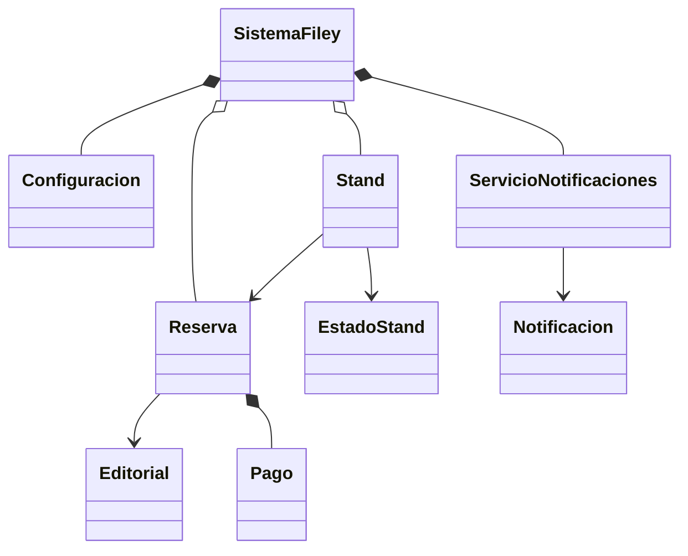

# Diagrama de clases

```mermaid
classDiagram
    SistemaFiley *-- Configuracion
    SistemaFiley o-- Stand
    SistemaFiley o-- Reserva
    SistemaFiley *-- ServicioNotificaciones
    Stand --> EstadoStand
    Stand --> Reserva
    Reserva --> Editorial
    Reserva *-- Pago
    ServicioNotificaciones --> Notificacion
```

`SistemaFiley` coordina stands, reservas, pagos y notificaciones. El paquete `domain` contiene las reglas del negocio y `notification` controla los avisos sin duplicarlos.
